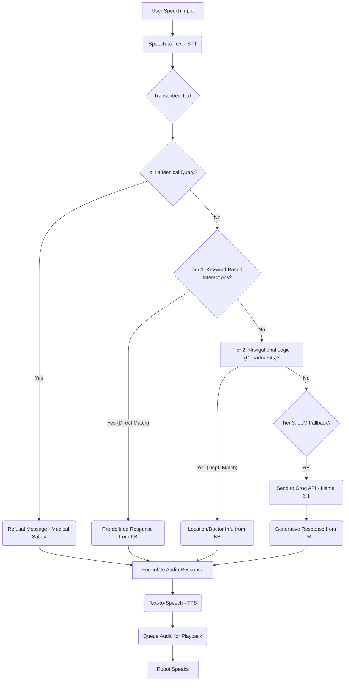

# Hospital Assistant Robot: System Architecture and Workflow

This document provides a detailed overview of the Hospital Assistant Robot's architecture, its codebase structure, high-level operational workflow, and the Natural Language Understanding (NLU) process.

---

## 1. Project Folder Structure

The project is organized into several key directories, each serving a specific purpose:

*   `.venv/`: Python virtual environment, containing isolated Python packages.
*   `audio_cache/`: Stores cached audio files, primarily for synthesized speech responses to avoid repeated TTS generation.
*   `config/`: Configuration files for system services (e.g., `hospital-robot.service` for `systemd`).
*   `data/`: Contains essential data files, such as the `hospital_knowledge_base.json`, various test data, and the `yolov8n.pt.zip` pre-trained object detection model.
*   `docs/`: Documentation files, including project knowledge base, reports, and troubleshooting guides.
*   `logs/`: Stores runtime logs, primarily `robot_run.log`, managed by a timed rotating file handler.
*   `scripts/`: Utility scripts for development, testing, analysis, and maintenance tasks.
*   `tests/`: Contains test suites for validating different components and functionalities of the robot.

---

## 2. High-Level System Architecture: Multi-Process Orchestration

The Hospital Assistant Robot employs a **decentralized multi-process architecture** leveraging Python's `multiprocessing` module. This design ensures modularity, fault isolation, and that compute-intensive tasks (like Vision) do not impede the real-time responsiveness required for user interaction and audio playback.

### Architectural Diagram

```
+----------------+       +----------------+       +-----------------+       +-----------------+
|   Main Process |------>| Vision Process |------>| Interaction     |------>|  Audio Manager  |
|   (main.py)    |<------+ (vision_       |<------|   Process       |<------|   Process       |
| (Orchestrator) |       |   process.py)  |       | (interaction_   |<------| (pyaudio_       |
+----------------+       +----------------+       |   process.py)   |       |   player.py)    |
         |                                         +--------^--------+       +-----------------+
         |                                                  |
         |                                                  |
         v                                                  |
+-----------------+                                         |
|  Motor Control  |<----------------------------------------+
|    Process      |
| (motor_control_ |
|   process.py)   |
+-----------------+
```

### Inter-Process Communication (IPC)

Processes communicate primarily through:

*   **Shared Queues (`multiprocessing.Queue`)**:
    *   `audio_queue`: Main channel for sending audio playback requests (file paths or commands) to the `Audio Manager`.
    *   `motor_queue`: Carries movement commands (e.g., "turn_to:90") destined for the `Motor Control` process.
    *   `audio_feedback_queue`: Used by the `Audio Manager` to inform other processes (e.g., `Interaction Process`) about the status of audio playback (e.g., "finished playing").
*   **Shared Events (`multiprocessing.Event`)**:
    *   `shutdown_flag`: A global signal that, when set, gracefully instructs all child processes to terminate.
    *   `audio_playing_flag`: A binary flag (`True`/`False`) indicating whether audio is currently being played. This is crucial for avoiding overlapping announcements (e.g., vision alerts deferring to high-priority user interaction audio).

---

## 3. High-Level Workflow of the Robot

The robot operates in a continuous loop, monitoring its environment and interacting with users:

```mermaid
graph TD
    A[Start Main Process] --> B(Initialize Queues & Events)
    B --> C(Spawn Child Processes)
    C --> D{Process Alive Check}

    D -- All OK --> D
    D -- Essential Process Died --> F[Set Shutdown Flag]

    subgraph Vision Loop
        VP_Start(Vision Process Start) --> VP_Capture(Capture Frame)
        VP_Capture --> VP_Detect(Detect People - YOLOv8)
        VP_Detect --> VP_Analyze(Analyze Crowd/Distancing/Queues)
        VP_Analyze -- Trigger Audio --> Audio_Queue("audio_queue.put(message)")
    end

    subgraph Interaction Loop
        IP_Start(Interaction Process Start) --> IP_Listen(Listen for Speech / Noise)
        IP_Listen -- Noise Detected --> IP_Noise(Process Noise - e.g., cough)
        IP_Noise -- Trigger Audio --> Audio_Queue
        IP_Listen -- Speech Detected --> IP_STT(Speech-to-Text)
        IP_STT --> IP_NLU(Natural Language Understanding)
        IP_NLU -- Determine Response --> IP_TTS(Generate Response / Text-to-Speech)
        IP_TTS -- Trigger Audio --> Audio_Queue
        IP_NLU -- Determine Motor Action --> Motor_Queue("motor_queue.put(command)")
    end

    subgraph Audio Loop
        AP_Start(Audio Player Start) --> AP_Wait(Wait for audio_queue)
        AP_Wait -- Play Request --> AP_Play(Play Audio File)
        AP_Play -- Audio Started --> AP_Flag_Set("audio_playing_flag.set()")
        AP_Play -- Audio Finished --> AP_Flag_Clear(audio_playing_flag.clear())
        AP_Flag_Clear --> AP_Wait
    end

    subgraph Motor Control Loop
        MC_Start(Motor Control Start) --> MC_Wait(Wait for motor_queue)
        MC_Wait -- Command Received --> MC_Execute(Execute Motor Command)
        MC_Execute --> MC_Wait
    end

    C --- VP_Start
    C --- IP_Start
    C --- AP_Start
    C --- MC_Start

    F --> G(Join Child Processes)
    G --> H(Exit Main Process)
```

---

## 4. Natural Language Understanding (NLU) Workflow

The `Interaction Process` (`src/interaction_process.py`) is responsible for interpreting user speech and formulating appropriate responses. It employs a tiered NLU hierarchy for robust and context-aware understanding:



### NLU Hierarchy Details:

1.  **Medical Safety Check**: The first and most critical step. Queries related to medical diagnosis or medication are strictly identified and met with a predefined refusal message to prevent the robot from providing potentially harmful advice.
2.  **Tier 1: Keyword-Based Interactions**: The system first attempts to match the transcribed text against a set of predefined keywords and phrases stored in the `interactions` section of `hospital_knowledge_base.json`. This handles common greetings, robot identity questions, or simple requests (e.g., "Where is the canteen?").
3.  **Tier 2: Navigational Logic**: If Tier 1 does not yield a direct match, the system then checks for keywords related to hospital departments (e.g., "Cardiology," "Pediatrics") or services. It uses the `departments` section of the `hospital_knowledge_base.json` to provide relevant information like location or associated doctors.
4.  **Tier 3: LLM Fallback**: If no specific match is found in the previous tiers, the query is routed to a Large Language Model (LLM) via the **Groq API (Llama 3.1)**. This allows for generative responses to more complex or open-ended questions, providing a more human-like interaction experience when direct knowledge base entries are insufficient.

This tiered approach ensures efficient handling of common requests while providing flexibility for more complex or unforeseen queries.
