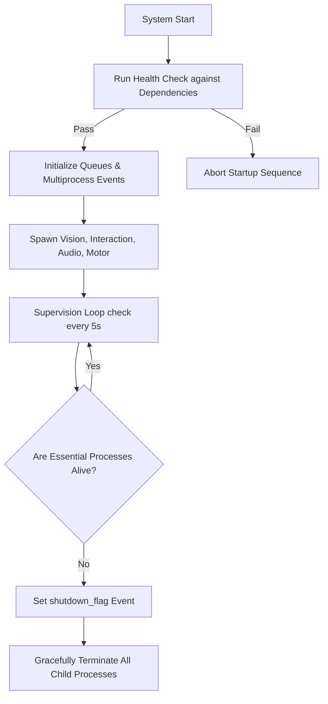
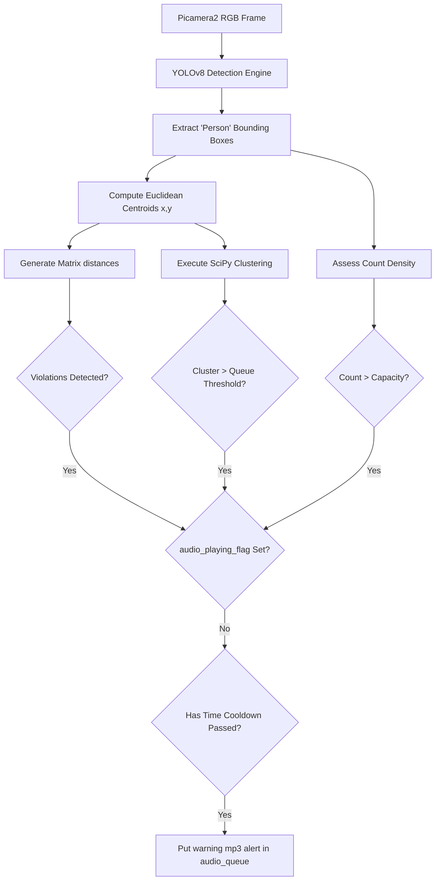
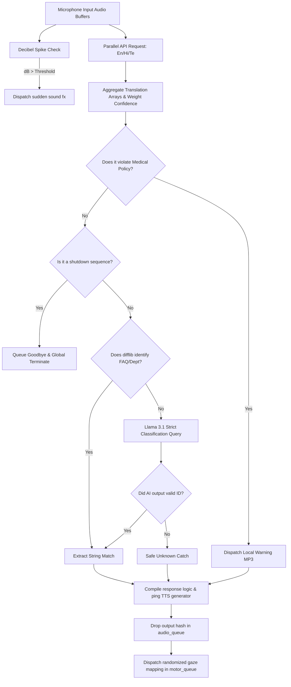
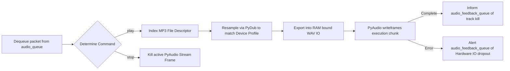
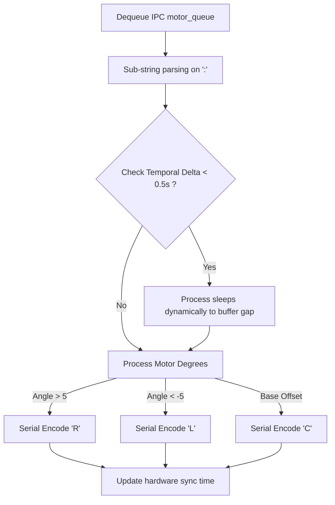

# Core System Workflow Documentation

This document provides a detailed visual and textual breakdown of the Hospital Assistant Robot's core processes. It explains what data enters each process, how it is processed, what logic is implemented, and how decisions are made.

---

## 1. Main Orchestrator (`main.py`)

**Input Data**: System startup commands and periodic timer checks (every 5 seconds).  
**Output Data**: Health status logging, spawning of process blocks, and global shutdown signals sent downstream across inter-process communication (IPC) mechanisms.

**Processing Logic**:
- **Initialization**: Sets up essential IPC queues (`audio_queue`, `motor_queue`, `audio_feedback_queue`) and globally accessible events (`shutdown_flag`, `audio_playing_flag`).
- **Orchestration**: Instantiates multiprocessing wrappers for the four main sub-systems (Vision, Interaction, Audio Player, Motor Controller) and starts them asynchronously.
- **Supervision**: Runs a continuous health loop checking if `interaction_process.py` and `pyaudio_player.py` remain alive.

**Decision Making**:
-   **If** an essential process terminates unexpectedly -> Broadcasts the termination event via `shutdown_flag`.
-   **If** a KeyboardInterrupt comes in -> Immediately sends `shutdown` strings to respective queues and attempts robust fallback joins.

---

## 2. Vision Pipeline (`vision_process.py`)

**Input Data**: Real-time video frames accessed from the Raspberry Pi camera module via Picamera2 (outputted as RGB888 matrix).  
**Output Data**: File play requests pushed into the `audio_queue` and visual matrices relayed to a local `cv2.imshow` window for debugging.

**Processing Logic**:
1.  **Detection**: The YOLOv8n AI model evaluates each incoming frame to detect 'person' bounding boxes requiring > 50% confidence.
2.  **Tracking (Centroid Calculation)**: Translates four-point bounding coordinates into a central `(x, y)` dot mapping the physical position estimation.
3.  **Heuristic Analysis**:
    -   *Crowd Depth*: Counts the absolute number of people inside the frame.
    -   *Social Distancing*: Computes Euclidean distance arrays between every captured dot.
    -   *Queue Detection*: Funnels matrix coordinates into SciPy hierarchical clustering libraries (`linkage`, `fcluster`), isolating localized structures indicating a line.

**Decision Making**:
-   **If** Overcrowding (Count > 25) -> Request `overcrowding.mp3`
-   **If** Dangerously Close Clusters -> Request `close_proximity.mp3`
-   **If** Queue Structure formed (>= 5 people tightly lined) -> Request `queue_forming.mp3`
-   **Gatekeeping Rule**: Before sending *any* sound constraint to the audio engine, the vision process checks `audio_playing_flag`. If audio is already active from an interaction session, the vision trigger aborts safely.

---

## 3. Interaction Pipeline (`interaction_process.py`)

**Input Data**: Ambient microphone frequencies transformed into PCM data byte streams.  
**Output Data**: Synthesized `gTTS` speech files queued for playback (`audio_queue`) and deterministic structural angles queued for robot joints (`motor_queue`).

**Processing Logic**:
1.  **Background Callback**: Monitors raw sound energy (dB). Spikes above calculated ambient volume are categorized natively as non-verbal noise (coughing/sneezing).
2.  **Speech Candidate Scoring**: Audio snippets are transcribed concurrently across En, Hi, and Te via Google APIs. Output strings are mathematically weighted based on language-specific sentence 'anchors' (e.g., specific grammar words) and keyword presence.
3.  **Intent Parsing & Safety Tiers**:
    -   *Tier 1 (Harm Prevention)*: Filters text explicitly against medical prescription nouns and disease diagnosis verbs.
    -   *Tier 2 (Database Match)*: Uses `difflib` algorithms to measure Levenshtein distances against expected FAQ inputs.
4.  **Generative AI Pipeline**: In absence of deterministic matches, formats user requests alongside the entire hospital knowledge base subset and ships via API to the strict Groq Llama-3.1 router to deduce classification IDs.

**Decision Making**:
-   **If** Med Trigger Word (i.e., 'symptoms of') -> Deny and warn dynamically.
-   **If** Exit keyword found -> Shut down system gracefully.
-   **If** LLM Engine identifies strict internal ID -> Output corresponding pre-written path context.
-   **If** LLM Hallucinates -> Deny. 
-   **Simultaneously**: The process automatically dispatches `turn_to:XX` rotational commands to the motor pipeline mirroring conversational engagement.

---

## 4. Audio Engine (`pyaudio_player.py`)

**Input Data**: Dictionaries specifying playback commands (like `{'command': 'play', 'file': 'xyz.mp3'}`).  
**Output Data**: Raw continuous stereo output frames broadcast over initialized speakers.

**Processing Logic**:
- Checks native hardware to query which bitrates and device indexes are actively supported.
- Captures highly compressed MP3 data out of the `audio_cache` cache filesystem.
- Recalculates frequency domain via `PyDub` to downsample/upsample the audio buffer to comply strictly with the connected hardware format restrictions (like jumping from 24kHz -> 48kHz seamlessly).

**Decision Making**:
-   **If** `play` task is received via queue while another is being handled -> Truncates current audio completely overriding the output stream directly in memory.
-   **If** Track Ends -> Inserts a `{'status': 'finished'}` log into `audio_feedback_queue` so the orchestration pipeline unblocks the system microphones.

---

## 5. Motor Pipeline (`motor_control_process.py`)

**Input Data**: Formatted strings fetched serially from `motor_queue` like `turn_to:30`.  
**Output Data**: Encoded ASCII payload chars communicated through Python Serial over standard hardware GPIO `/dev/ttyAMA0`.

**Processing Logic**:
- Integrates a real-time hard-limiter constraint (`time.time()`) blocking consecutive motor executions firing under 0.5s intervals mitigating physical mechanical gear grind.
- Strips incoming numerical degrees down to generic direction strings to conform to firmware rules on the motor controller board.

**Decision Making**:
-   **If** angle > 5 degrees -> Forward logic `R` (Right Move Protocol).
-   **If** angle < -5 degrees -> Forward logic `L` (Left Move Protocol).
-   **Else** (-5 <= angle <= 5) -> Forward logic `C` (Force structural centering).

